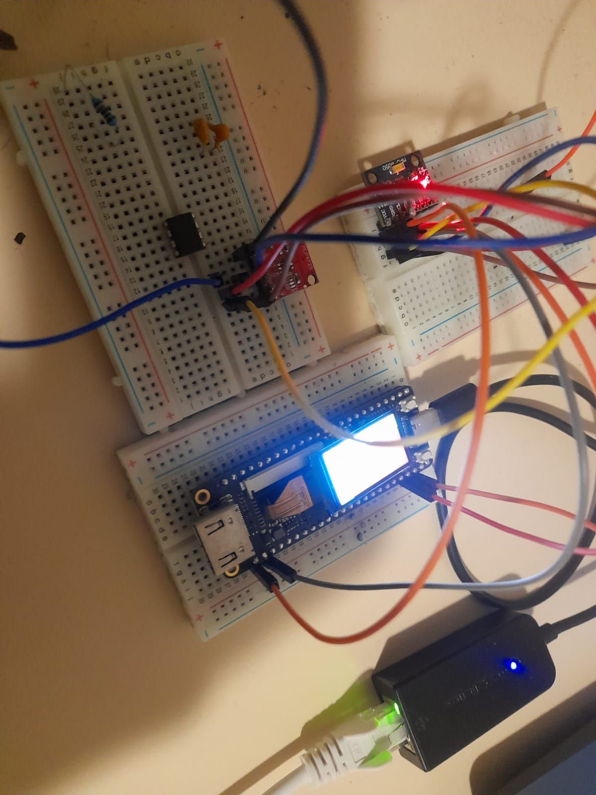
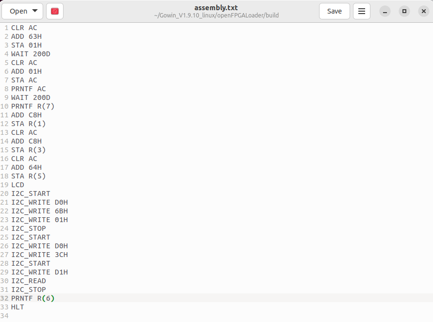
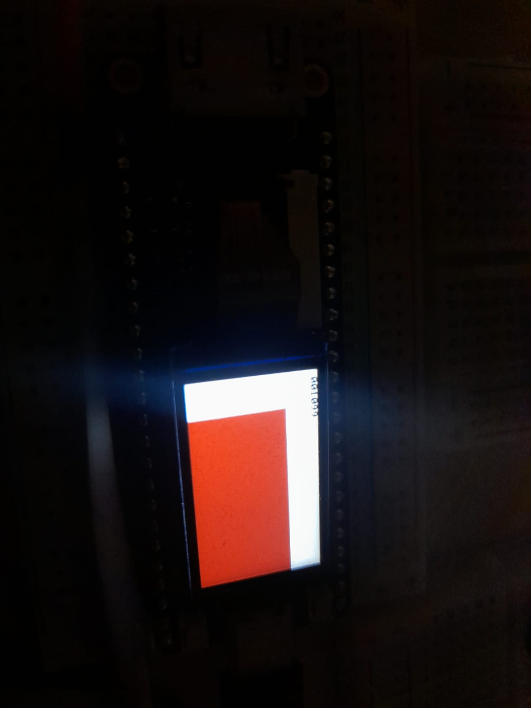

# 8-Bit VHDL CPU

Custom 8-bit processor implemented in VHDL with a small assembler and several peripheral controllers. The project combines a simple CPU core with UART, SPI LCD, external SPI flash, block RAM, and I2C support.

This repository is intended as a portfolio-quality snapshot of the design rather than a full FPGA product release.

## Overview

The processor follows a simple fetch/decode/retrieve/execute flow and keeps the design centered on a compact instruction format and direct peripheral access.

Main architectural blocks:

- Control unit implemented as a state machine in `vhdl/cpu.vhd`
- Accumulator-based arithmetic and logic operations
- Local RAM and external SPI-backed program/data access
- UART input/output for communication with a host PC
- SPI LCD driver for text and drawing output
- I2C controller for simple external device access

The accompanying design document gives a higher-level explanation of the architecture and operating flow:

- [8_Bit_Processor.pdf](./8_Bit_Processor.pdf)

## Repository Layout

- `vhdl/` - CPU core and peripheral HDL modules
- `python/as.py` - assembler for the custom instruction format
- `examples/` - sample assembly programs
- `cst/s.cst` - FPGA pin constraints
- `pic/` - board photos and demo images
- `8_Bit_Processor.pdf` - design summary

## Main Source Files

- `vhdl/cpu.vhd` - top-level CPU, instruction decode, flags, and control flow
- `vhdl/lcd.vhd` - SPI LCD initialization, drawing, and text rendering
- `vhdl/spi_ex.vhd` - external SPI flash read path
- `vhdl/block_ram.vhd` - synchronous block RAM
- `vhdl/uart_rx.vhd` / `vhdl/uart_tx.vhd` - UART receiver/transmitter
- `vhdl/i2c.vhd` - minimal I2C command controller

## Instruction Style

The assembler currently supports three broad operand styles:

- Accumulator operations such as `CLR AC`, `PRNT AC`, `SHL AC`
- Register-indexed RAM operations such as `ADD R(3)`, `WAIT R(0)`
- Immediate operations such as `ADD 0AH`, `JMP 10H`, `PRNT 41H`

Examples:

```text
CLR AC
ADD 0AH
STA R(0)
PRNT "HI"
HLT
```

## Assembler Usage

Assemble a source file into a binary image:

```bash
python3 python/as.py examples/hello.asm -o compile.bin
```

Print the encoded bytes while assembling:

```bash
python3 python/as.py examples/hello.asm -o compile.bin --print-binary
```

Optionally flash the generated binary with `openFPGALoader`:

```bash
python3 python/as.py examples/hello.asm -o compile.bin \
  --flash --loader ./openFPGALoader --board tangnano9k
```

Run `python3 python/as.py --help` for the full CLI.

## Example Program

`examples/hello.asm` prints a short string and halts:

```text
PRNT "HELLO"
HLT
```

## Build Notes

- The repository contains source code, constraints, documentation, and images.
- Vendor project files, synthesis outputs, and bitstreams are not included.
- The exact FPGA build flow used for the original hardware setup is not fully reproduced here.
- The Python assembler is validated locally, but HDL synthesis and on-board verification still depend on your FPGA toolchain.

## Project Status

Current status:

- Source preserved and cleaned for publication
- Assembler converted into a reusable CLI tool
- Basic example program included
- Documentation improved for GitHub presentation

Missing for a full release:

- Reproducible synthesis/project files
- Testbenches or simulation scripts
- Automated hardware validation

## Images

### Board wiring


### Demo code


### LCD output

